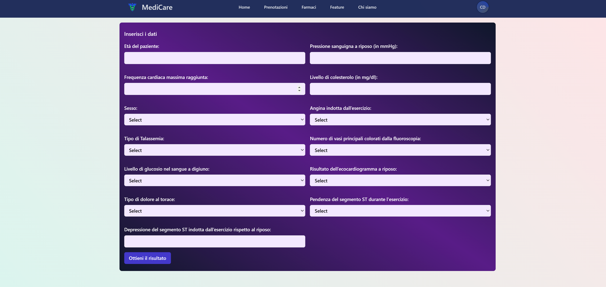

# CardIAca

  

 Artficial Intelligence to prevent Heart Attack 
   
   
  University of Salerno

# Introduction
The main goal of CardIAca is to provide a reliable Artificial Intelligence to help patients when they are approaching to understand if there is a risk of an Heart Attack. The main benefit of this AI is the reduce
of the waiting time once you have made the medical examination, giving the possibility to prevent as soon as possible the risk of the Heart Attack. The documentation and the main code of the several agents is provided in this Repository.

## Authors
* **Giovanni Casaburi**         - *Head Developer* - [Giodvk](https://github.com/Giodvk)
* **Salvatore Basilicata**         - *Developer* - [sasibasi](https://github.com/sasibasi)
* **Primo Vinicio Calabrese**         - *Developer* - [PRIMOVINICIOCALABRESE](https://github.com/PRIMOVINICIOCALABRESE)

# Language and Tools
* [Python](https://www.python.org/) - The programming language used for the entire development of the project.
* [Scikit learn](https://scikit-learn.org/stable/) - An Open Source Library for the Machine Learning.
* [Pandas](https://pandas.pydata.org/) - An Open Source Library for the Data Preparation and Analysis

# Other Informations
For any additional information about the GUI, the use of the AI or the deployment, these further information can be found in the repository of [MediCare](https://github.com/Giodvk/MediCare), the environment of CardIAca, here some preview.

  Home Page AI Module

  

 

  Form for the Prediction

  

